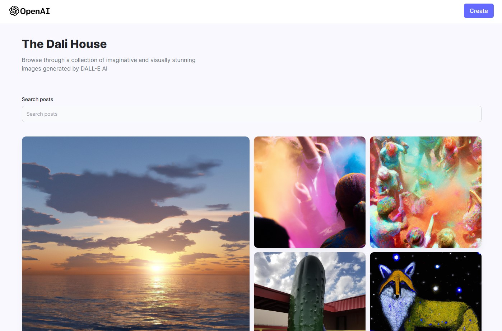
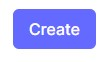
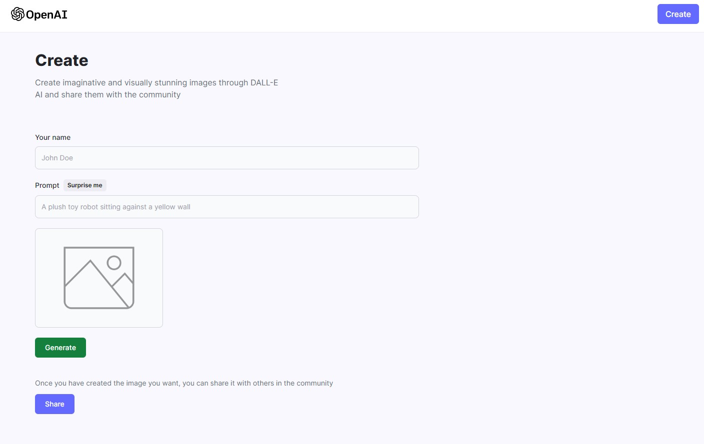
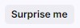

# The Dali House

## Description

A Full-Stack (MERN) AI image generator that uses the OpenAI api to generate the images based on a user prompt. The user can then save the image to the community gallery and it will be saved in mongodb and cloudinary.

## Table of Contents

- [Useage](#useage)
- [Technologies](#technologies)
- [License](#license)
- [Contact](#contact)
- [Links](#links)

## Useage

Visit [The Dali House](https://the-dali-house.vercel.app/)

#### Desktop layout

Click on the  button. You will then be directed to the create-post page.

### Desktop layout

Enter your name and a prompt to generate your image. If you are stuck and don't know what you would like your prompt to be, click  to get a random prompt from our selection of 50 pre-made prompts. Once you are happy with your prompt, click . DALL-E AI will then generate an image for you. If you are unhappy with the image, just click the Generate button again to get a new image. Once you are satisfied with the generated image you may share it on the home page by clicking . This will redirect you back to the home page where your image will be displayed at the top. You can search the community images with the search bar at the top and you can hover over each image to see who generated the image, the eprompt they used, and a download button so you can download if image if you like.

## Technologies

React, Vite, JavaScript, node.js, npm packages(express, nodemon, mongoose), HTML, TailwindCSS, MongoDB, Render, MVC model, Vercel, and Cloudinary.

## License

Licensed under the [MIT](https://choosealicense.com/licenses/mit/) license

## Contact

Email: timmartin13@gmail.com

Github: [TimMartin13](https://github.com/TimMartin13)

## Links

Deployed link: https://the-dali-house.vercel.app/

Repository link: https://github.com/TimMartin13/the-dali-house
